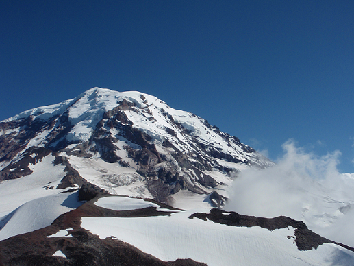

 
(Panorama image of Mt. Rainer in Washington USA.)

# Panorama Stitching

## Overview
Panoramic stitching is an early success of computer vision. Matthew Brown and David G. Lowe published a famous [panoramic image stitching paper](http://www.cs.ubc.ca/~lowe/papers/07brown.pdf) in 2007. Since then, automatic panorama stitching technology has been widely adopted in many applications such as Google Street View, panorama photos on smartphones, and stitching software such as [Photosynth](http://photosynth.net/) and [AutoStitch](http://cs.bath.ac.uk/brown/autostitch/autostitch.html).

In this project, SIFT keypoints will be matched from multiple images to build a single panoramic image. This will involve several tasks:

* Detect SIFT points and extract SIFT descriptor for each keypoint in an image using vlfeat.

* Compare two sets of SIFT descriptors coming from two different images and find matching keypoints (`SIFTMatcher.py`).

* Given a list of matching keypoints, use least-square method to find the affine transformation matrix that maps positions in image 1 to positions in image 2 (`ComputeAffineMatrix.py`).

* Use RANSAC to give a more robust estimate of affine transformation matrix (`RANSACFit.py`).

* Given that transformation matrix, use it to transform (shift, scale, or skew) image 1 and overlay it on top of image 2, forming a panorama. (This is done for you.)

 
(Left: image 1 & Right: image 2)
 

 
(Stitched image)

* Stitch multiple images together under a simplified case of real-world scenario ('MultipleStitch.py').

## Details
Now the details of each step are:

### 1. Get SIFT points and descriptors
* Prerequired packages: [Anaconda python 3.6](https://www.anaconda.com/download/) 
* Install [cyvlfeat](https://github.com/menpo/cyvlfeat) for fetching sift features: `conda install -c menpo cyvlfeat` 
I only use the `sift` function.

 

### 2. Matching SIFT Descriptors
* Install [sklearn](https://scikit-learn.org/stable/) for matching SIFT descriptors using Kd-tree. 
> The Euclidean distance was calculated between a given SIFT descriptor from image 1 and all SIFT descriptors from image 2. Rather than directly utilizing k-nearest neighbors algorithm (O(N) complexity) to find the matcher, I use kd-tree (O(logN) complexity) to achieve this. If the distance to the closest vector is significantly (by a factor which is given) smaller than the distance to the second-closest, we call it a match. The output of the function is an array where each row holds the indices of one pair of matching descriptors.
Remember, Euclidean distance between vectors \\(a\in R^n\\) and \\(b\in R^n\\) is
\\[
\sqrt{(a[1]-b[1])^2+(a[2]-b[2])^2+...+(a[n]-b[n])^2}
\\]

 

### 3. Fitting the Transformation Matrix
> We now have a list of matched keypoints across the two images! We will use this to find a transformation
matrix that maps an image 1 point to the corresponding coordinates in image 2. In other words, if the point
\\([x_1, y_1]\\) in image 1 matches with \\([x_2, y_2]\\) in image 2, we need to find a transformation matrix H such that
\\[
[x_2 y_2 1] = [x_1 y_1 1]H'
\\]
With a sufficient number of points, our code can solve for the best H for us. Edit `ComputeAffineMatrix.py` to calculate H given the list of matching points. 

 

### 4. RANSAC
> Rather than directly feeding all of our SIFT keypoint matches into `ComputeAffineMatrix.py`, we will use RANSAC (“RANdom SAmple Consensus”) to select only “inliers” to use to compute the transformation matrix. In this case, inliers are pairs whose relationship is described by the same transformation matrix. The Euclidean distance between Hp1 and p2:
\\[
\||[x_2 y_2 1] - [x_1 y_1 1]H'\||_2
\\]
where \\(\|| \;\||_2\\) is the Euclidean distance, as defined above.

 

### 5. Stitching Multiple Images
> Given a sequence of m images (e.g., yosemite\*.jpg)
\\[
Img_1, Img_2,...,Img_m
\\]
our code takes every neighboring pair of images and computes the transformation matrix which converts points from the coordinate frame of \\(Img_i\\) to the frame of \\(Img_{i+1}\\). (It does this by simply calling your code on each pair.)
We then select a reference image \\(Img_r\\). We want our final panorama image to be in the coordinate frame of \\(Img_r\\). So, for each \\(Img_i\\) that is not the reference image, we need a transformation matrix that will convert points in frame i to frame ref.  

## Future Work
### Stitching unordered sequence of images
> Given an unordered set of m images (e.g., Rainier\*.jpg), how can we find the 1. reference image, and 2 the most robust transformation to the reference image (bundle adjustment). 
**Described in [panoramic image stitching paper](http://www.cs.ubc.ca/~lowe/papers/07brown.pdf).**
 

## Credits
	Assignment modified by Wen-Chuan Chen based on Min Sun, Fei-Fei Li and Ali Farhadi's previous developed projects
