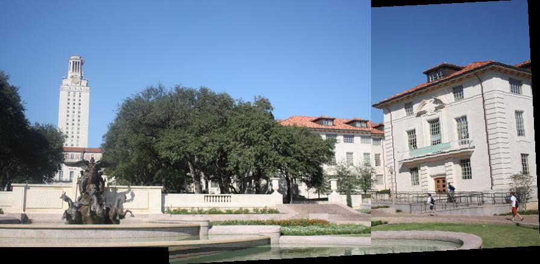
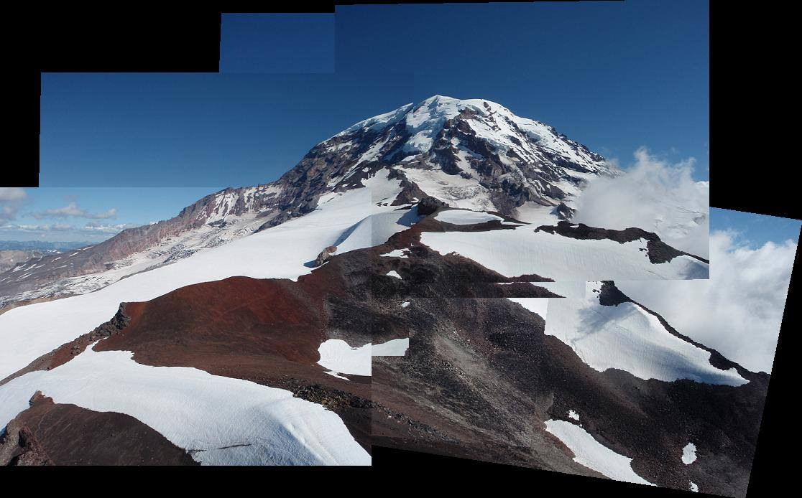
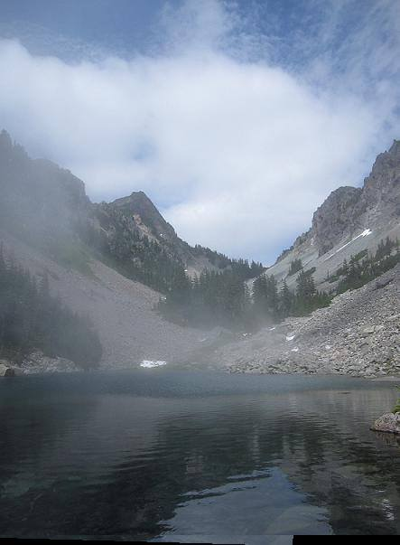
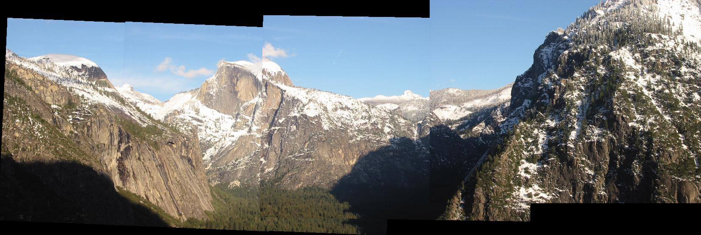
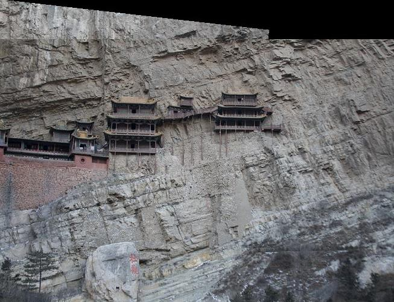

# Wen-Chuan Chen (106033548)

# Project 2 / Panorama Stitching

## Overview
The project is related to use Panrorama Stitching to find the invariant points which will be the referenced points when we conduct stitching. 

## Implementation
1. SIFTSimpleMatcher.py
	Implement a matcher in SIFTSimpleMatcher() function by calculating the descriptors of two images

2. ComputeAffineMatrix.py
	Implement a least square solution to find the affine matrix in ComputeAffineMatrix.py

3. RANSACFit.py
	Implement ComputeErroe() function that compute and returns the distances from SIFTSimpleMatcher

4. MultipleStitch.py
	calculate the A 3x3 homogeneous Transformation matrix in makeTransformToReferenceFrame()

## Installation
* conda install -c menpo cyvlfeat
* How to compile from source?

### Results

1. Uttower

2. Rainier

3. MelakwaLake

4. Yosemite

5. Hanging
